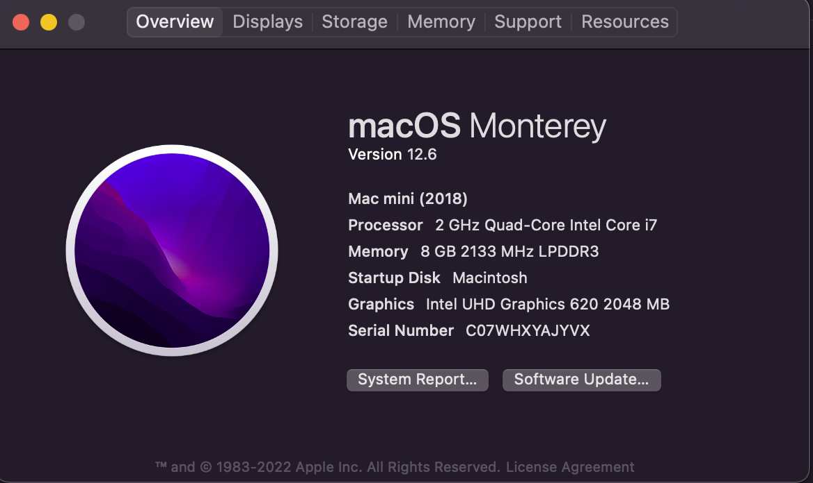

# HP-ENVY-13-AH1004TX-Hackintosh
  
For the people who need it .Thus, here is an introduction on [zhihu](https://zhuanlan.zhihu.com/p/576461671).(article finished =.=)

# Specifications
Processor: Intel(R) Core(TM) i7-8565U CPU @ 1.80GHz 

Model: HP ENVY Laptop 13-ah1xxx

Graphics: Intel(R) UHD Graphics 620

RAM: 8GB

BIOS ver.: F.25

Hard Disk: INTEL SSDPEKKF360G7H (360 GB, PCI-E 3.0 x4)

Network：Intel(R) Wireless-AC 9560 160MHz
  
## about

 

## What NOT works

### There will be a kernel panic from time to time, especially after boot/reboot. Here is short for the log

> panic(cpu 0 caller 0xffffff8009b856a2): nvme: "3rd party NVMe controller. PCI link down. Delete IO submission queue. fBuiltIn=1 MODEL=INTEL SSDPEKKF360G7H FW=HP01 CSTS=0xffffffff US[1]=0x0 US[0]=0x227 VID=0xffff DID=0xffff CRITICAL_WARNING=0x0.\n" @IONVMeController.cpp:6090

It means that the panic should be linked to a NVMe SSD, I cannot find usefull information on the net.

### Only the two rear speakers work
 solution: you can find a way here https://github.com/dkoluris/HP-ENVY-13-AH0002-OpenCore 
 
 
 I did not give it a try, cuz i have given up on hackintosh lol.
